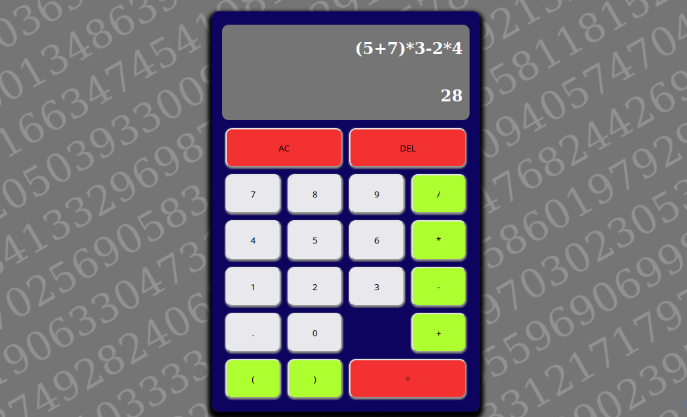

This project is to create a calculator with basic JS, HTML and CSS, without frameworks

# Calculator Project - Marcelo Rocha

##Important: Keyboard 'c' = AC button, Keyboard 'r' = DEL button in calculator.

## Some features:

 - Keyboard integration;
 - Beautiful background;
 - 4 Operands;
 - Auto round numbers;

## Learning:

- Good logic problem solving;
- RegEx use and String manipulation;
- DOM manipulation;
- Functional programming;

